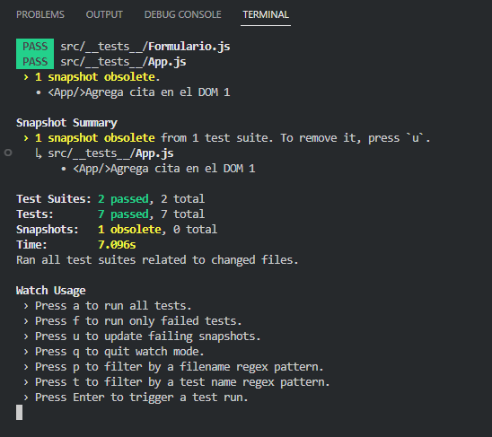

## Testing con [Jest / React-Testing-Library]

Chequeo de:

- Existencia de elementos de determinados componentes.
- Funciones.
- LLenado de datos de formularios.
- Funcionamiento completo de la App.
- Snapshots.

###### Correr la aplicacion:

### `npm start`

###### Para correr los test:

### `npm run test`

